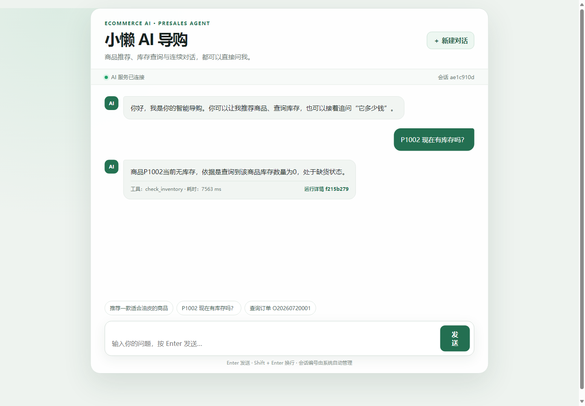
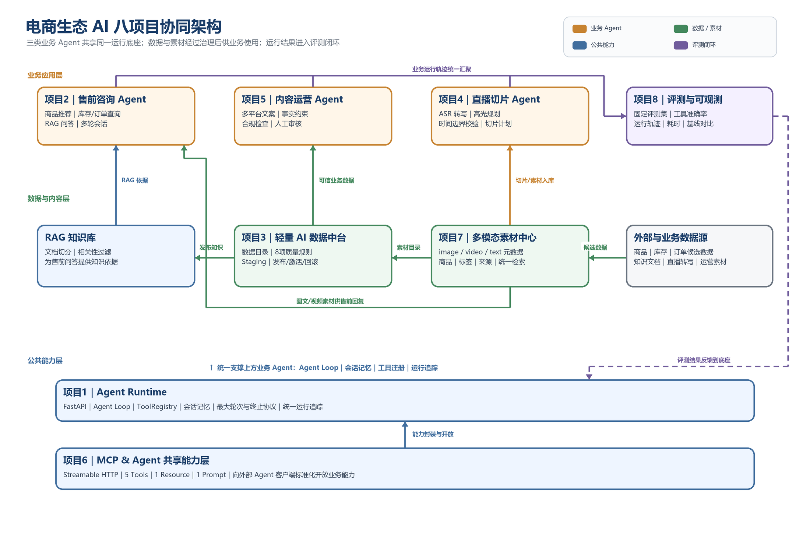

# 电商生态 AI Agent 平台

[](https://github.com/H-shuohao/ecommerce-ai-platform/actions/workflows/ai-core-tests.yml)
[](services/ai-core/pyproject.toml)
[](services/ai-core/main.py)
[](services/ai-core/app/mcp/server.py)
[](docker-compose.yml)

面向应届生求职展示的个人 AI 工程项目。项目以模拟电商商品、库存和订单数据为业务基础，将大模型、RAG、Agent Loop、MCP、数据治理、评测与可观测能力组合成一套可以真实运行和验证的轻量平台。

> 项目定位：个人作品集与工程实践，不宣称为真实企业生产系统。

**快速导航：**
[在线仓库](https://github.com/H-shuohao/ecommerce-ai-platform) ·
[系统架构](docs/architecture/current-system.md) ·
[八模块完成度](docs/architecture/eight-project-roadmap.md) ·
[五分钟演示](docs/demo/five-minute-walkthrough.md) ·
[真实评测记录](docs/evaluation/2026-07-21-presales-baseline.md)

## 30秒看懂项目

普通大模型不知道实时库存和订单，直接回答容易产生幻觉。本项目采用明确分工：

```text
LLM：理解问题、规划工具、组织回答
Tools：查询商品、库存、订单等动态事实
RAG：检索商品说明、规则和文档知识
Backend：校验模型输出、控制循环、保存状态、记录轨迹
Evaluation：使用固定题目检查工具选择、答案与耗时
```

项目不是只有一个聊天页面：每次回答都可以追踪到具体工具、参数、结果和耗时，并通过数据质量门禁、内容审核、自动评测、Docker与CI补齐AI应用工程闭环。

## 运行效果



图中问题通过 `check_inventory` 查询实时库存；右下角“运行详情”可继续查看工具参数、工具结果和本次运行耗时。

## 架构概览



这八项是同一平台中的协同模块，不是八套彼此独立的商业系统。项目1和项目6提供公共底座；项目2、4、5承载业务场景；项目3和项目7管理可信数据与内容资产；项目8形成评测反馈闭环。

更详细的请求链路和 Mermaid 图见[当前已实现系统架构](docs/architecture/current-system.md)。

## 八模块完成度

| 模块 | 当前状态 | 可验证能力 |
|---|---|---|
| 项目1 Agent Runtime | 核心功能完成 | Agent Loop、ToolRegistry、会话记忆、终止协议、运行追踪 |
| 项目2 售前咨询 Agent | 核心功能完成 | 商品/库存/订单/RAG、多轮指代追问、Web Demo |
| 项目3 轻量数据中台 | MVP完成 | 数据目录、8项质量规则、Staging、发布/激活/回滚 |
| 项目4 直播切片 Agent | 基础版 | 带时间戳转写、高光规划、边界校验；未做FFmpeg物理裁剪 |
| 项目5 内容运营 Agent | 核心功能完成 | 多平台文案、事实约束、草稿、合规检查、人工审核 |
| 项目6 MCP共享能力层 | 核心功能完成 | Streamable HTTP、5 Tools、1 Resource、1 Prompt |
| 项目7 多模态素材中心 | 基础版 | image/video/text元数据、商品/标签/来源关联；未接对象存储 |
| 项目8 评测与可观测 | 评测版完成 | Run轨迹、固定评测集、工具准确率、历史与基线比较 |

## 技术栈

- **AI应用**：LLM、RAG、Agent Loop、结构化工具调用、Prompt约束、MCP
- **后端**：Python 3.13、FastAPI、Pydantic、SQLite、REST API
- **工程化**：Docker、Docker Compose、GitHub Actions、unittest
- **外部能力**：火山方舟模型、火山知识库、RTC / ASR / TTS

## 主要工程能力

- **售前咨询 Agent**：大模型规划工具调用，支持商品搜索、商品详情、实时库存和订单查询。
- **多轮会话记忆**：使用 SQLite 保存会话，前端自动管理 `session_id`，动态库存问题强制刷新。
- **RAG 与大模型**：接入火山引擎知识库和模型服务，支持相关性过滤与调试接口。
- **内容运营 Agent**：生成多平台商品文案，支持草稿、编辑、人工审核和高风险内容拦截。
- **多模态素材中心（基础版）**：统一登记图片、视频和文本素材元数据，支持商品、类型和标签检索。
- **直播切片 Agent（基础版）**：根据带时间戳转写识别直播高光，校验时间范围并沉淀视频切片计划。
- **轻量数据中台**：数据资产目录、8项质量规则、候选数据校验、发布门禁、版本激活和回滚。
- **Agent 评测系统**：固定测试集、工具选择准确率、耗时、历史版本与基线对比。
- **运行可观测性**：记录 Agent 运行、工具调用、成功率、耗时和 RAG 使用情况。
- **标准 MCP Server**：通过 Streamable HTTP 暴露5个 Tools、1个 Resource和1个 Prompt。
- **RTC 语音链路**：保留原项目 RTC、ASR、LLM/RAG、TTS 回调能力。
- **容器化交付**：Dockerfile、Docker Compose、健康检查、端口映射和 SQLite 数据持久化。
- **持续集成**：GitHub Actions 在独立 Python 3.13 环境中自动运行测试。

## 真实验证结果

- 自动化测试：`55/55` 通过。
- 售前 Agent 基线评测：`4/4` 通过。
- 工具选择准确率：`100%`。
- 基线平均耗时：`6368.75 ms`（真实模型调用环境，结果会随网络与模型状态变化）。
- Docker 容器健康状态：`healthy`，`/health` 与 `/docs` 均返回 HTTP 200。

> 评测中的100%仅代表当前4个固定核心案例，不代表所有自然语言问题都能达到100%准确率。耗时受外部模型和网络状态影响。

## 目录结构

```text
ecommerce-ai-platform/
├─ .cursor/                 # Cursor 项目级 MCP 配置
├─ docs/
│  ├─ architecture/         # 架构与技术决策
│  ├─ evaluation/           # 真实评测记录
│  └─ demo/                 # 稳定演示路线
├─ services/
│  └─ ai-core/
│     ├─ app/               # API、Schema、Repository、Tools、MCP
│     ├─ services/          # Agent、RAG、数据中台、评测等业务服务
│     ├─ data/              # 演示业务数据与 SQLite 数据
│     ├─ tests/             # 自动化测试
│     ├─ web/               # 售前对话演示页面
│     └─ Dockerfile
├─ docker-compose.yml
└─ README.md
```

## 本地开发启动

### 1. 准备环境变量

```powershell
Copy-Item services\ai-core\.env.example services\ai-core\.env
```

在本地`.env`中填写需要使用的外部服务配置；不要提交真实密钥。

### 2. 安装依赖并启动

```powershell
cd services\ai-core
uv sync --locked
uv run uvicorn main:app --reload --port 8000
```

也可以使用项目现有虚拟环境：

```powershell
cd services\ai-core
.\.venv\Scripts\python.exe main.py
```

## Docker 启动

在仓库根目录执行：

```powershell
docker compose up --build -d
docker compose ps
```

查看日志和停止服务：

```powershell
docker compose logs -f ai-core
docker compose down
```

开发模式与 Docker 模式不要同时启动，否则都会占用8000端口。

## 访问入口

- 对话演示：<http://127.0.0.1:8000/demo>
- Swagger：<http://127.0.0.1:8000/docs>
- 健康检查：<http://127.0.0.1:8000/health>
- MCP Streamable HTTP：`http://127.0.0.1:8000/mcp/`

## MCP 本地验证

保持后端运行，在第二个终端执行：

```powershell
cd services\ai-core
.\.venv\Scripts\python.exe scripts\test_mcp_client.py
```

客户端将完成 MCP 初始化、5个工具发现、数据目录资源读取、售前 Prompt 获取和库存工具调用。

## 自动化测试

测试必须从 `services/ai-core` 目录运行：

```powershell
cd services\ai-core
.\.venv\Scripts\python.exe -m unittest discover -s tests -v
```

同一测试命令已配置在 `.github/workflows/ai-core-tests.yml`。推送到 GitHub 后，会在 `main` 分支的 push 和 pull request 上自动运行。

## 环境变量与安全

1. 复制 `services/ai-core/.env.example` 为 `.env`。
2. 只在本地 `.env` 中填写真实密钥。
3. `.env` 已被 Git 和 Docker 构建上下文排除。
4. Docker Compose 在容器启动时注入环境变量，不把密钥写入镜像。

未配置外部模型、知识库或 RTC 凭据时，部分真实外部能力不可用，但本地商品、库存、订单、数据中台、评测和基础 API 仍可运行。

## 当前边界与后续路线

当前重点完成了 AI Core、售前 Agent、内容 Agent、轻量数据中台、评测、MCP、素材中心基础版、直播切片规划基础版和容器化闭环。FFmpeg物理裁剪、真实对象存储、生成式图片/视频和模型微调仍属于后续路线，不在当前简历中描述为已完成能力。

下一阶段优先级：

1. 将固定Agent评测集从4条扩展到20～30条，并统计参数准确率、P50/P95耗时和失败类型；
2. 使用PostgreSQL、Redis、JWT与角色权限增强后端生产化能力；
3. 增加结构化日志、超时/重试/限流、指标监控和压测报告；
4. 打通上传、ASR、切片规划、FFmpeg裁剪和对象存储的直播素材闭环。

所有简历指标必须来自真实测试或运行记录，不虚构并发量、准确率、用户规模和商业收益。
