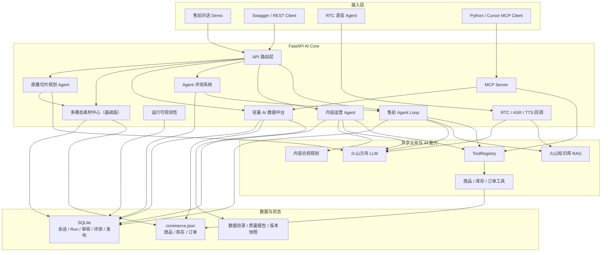
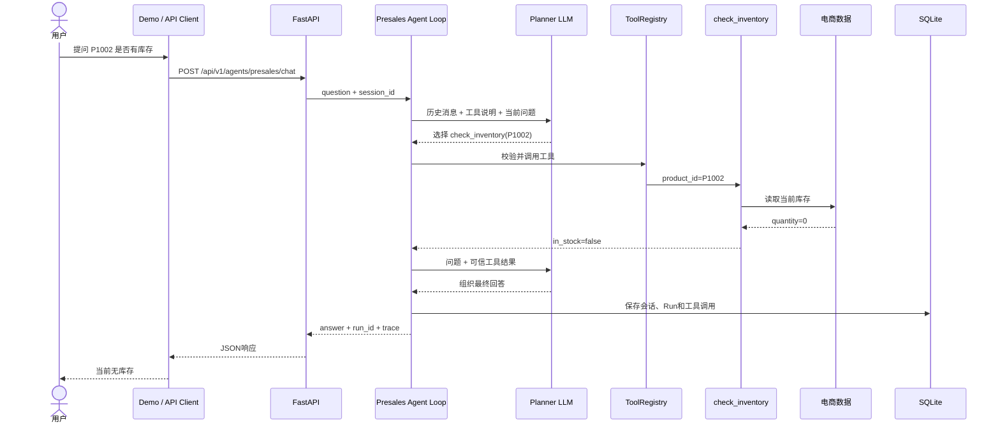
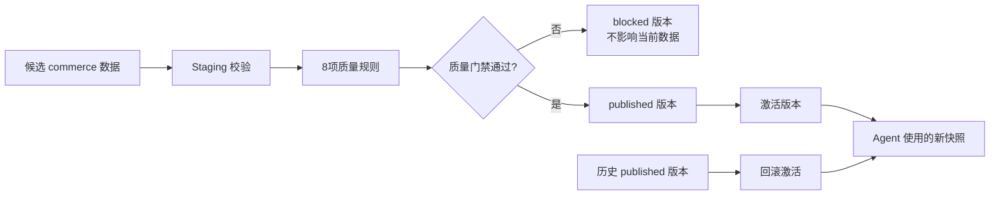

# 当前已实现系统架构

这张图只展示仓库中已经实现并验证的能力。直播切片和多模态素材中心按“基础版”展示；模型微调尚未实现，因此不画入已完成架构。

## 总体架构



## 售前问题请求链路

以下链路以“请查询商品 P1002 是否有库存”为例。



## 数据中台发布链路



## MCP 对外能力

```text
MCP Server (Streamable HTTP /mcp/)
├─ Tools
│  ├─ search_products
│  ├─ get_product
│  ├─ check_inventory
│  ├─ query_order
│  └─ search_media_assets
├─ Resources
│  └─ commerce://data-catalog
└─ Prompts
   └─ presales_assistant
```

## 如何讲这张图

面试时先讲主链路，不要逐个念技术名词：

> 用户通过网页、REST或语音入口访问 FastAPI。售前 Agent 使用大模型做工具规划，通过统一 ToolRegistry 查询商品、库存和订单，必要时结合 RAG，再由大模型组织回答。会话、工具调用、运行耗时和评测结果进入 SQLite。数据中台负责数据目录、质量校验、发布和回滚。相同业务工具还通过标准 MCP Server 提供给外部 Agent 客户端。服务最终使用 Docker Compose 进行标准化启动和健康检查。

然后根据面试官追问，再展开 Agent Loop、数据中台、MCP或评测模块。
